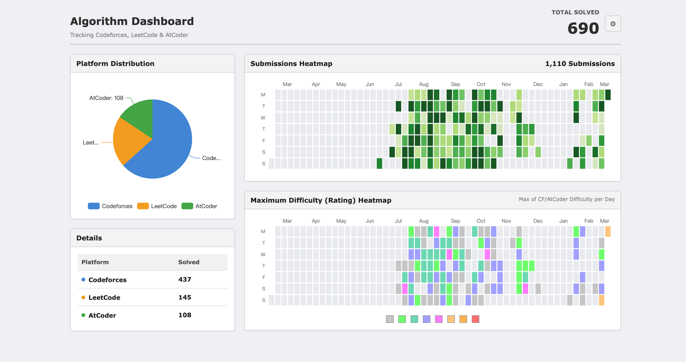

# OJ Dashboard

**将 Codeforces、LeetCode、AtCoder 三大平台的提交记录聚合到一张热力图上。**

你可能在 Codeforces 上打比赛，在 LeetCode 上刷题，在 AtCoder 上练手 —— 但没有一个地方能看到你**所有平台加在一起**的训练热度图。OJ Dashboard 就是为此而生：一个统一的 GitHub 风格提交热力图，让你的训练成果一目了然。

## ✨ 功能

- 🔥 **统一热力图** — 三个平台的提交次数聚合到一张日历热力图上，完整反映你的训练节奏
- 🏆 **难度热力图** — 展示每日所做最难题目的 Rating（CF / AtCoder）
- 📊 **题数统计** — 汇总各平台已 AC 的题目数量，饼图展示分布
- 🎯 **交互式输入** — 打开页面直接输入用户名即可，无需编辑配置文件
- 💾 **自动记住** — 用户名保存在浏览器本地，下次无需重填

## 预览


## 🚀 快速开始

### 1. 克隆仓库

```bash
git clone https://github.com/your-username/oj-dashboard.git
cd oj-dashboard
```

### 2. 安装依赖

```bash
pip install -r requirements.txt
```

### 3. 启动

```bash
python server.py
```

### 4. 使用

打开 [http://localhost:8080](http://localhost:8080)，输入你在各平台的用户名，点击「生成仪表盘」。

> 首次加载约需 5–15 秒，因为要从三个平台拉取数据。

## 🎨 平台配色

| 平台 | 颜色 |
|------|------|
| Codeforces | 🔵 蓝色 `#4A90D9` |
| LeetCode | 🟡 黄色 `#F5A623` |
| AtCoder | 🟢 绿色 `#4CAF50` |

## 📁 项目结构

```
oj-dashboard/
├── server.py          # Flask 后端
├── fetcher.py         # 各平台 API 数据抓取
├── config.json        # 可选的默认配置
├── requirements.txt   # Python 依赖
└── static/
    ├── index.html     # 前端页面
    ├── style.css      # 样式
    └── app.js         # 前端逻辑
```

## ⚙️ 可选：预设配置

除了网页端输入，也可编辑 `config.json` 预设用户名（当 URL 无参数时自动读取）：

```json
{
  "codeforces": { "handle": "your_cf_handle" },
  "leetcode": { "username": "your_lc_username", "site": "cn" },
  "atcoder": { "username": "your_atcoder_username" }
}
```

`site` 填 `"cn"` 为力扣中国站，`"com"` 为国际站。

## 🔧 技术栈

Python Flask + ECharts，数据来自 Codeforces 官方 API、LeetCode GraphQL API、AtCoder (kenkoooo) API。

实际上就是antigravity生成的(doge)